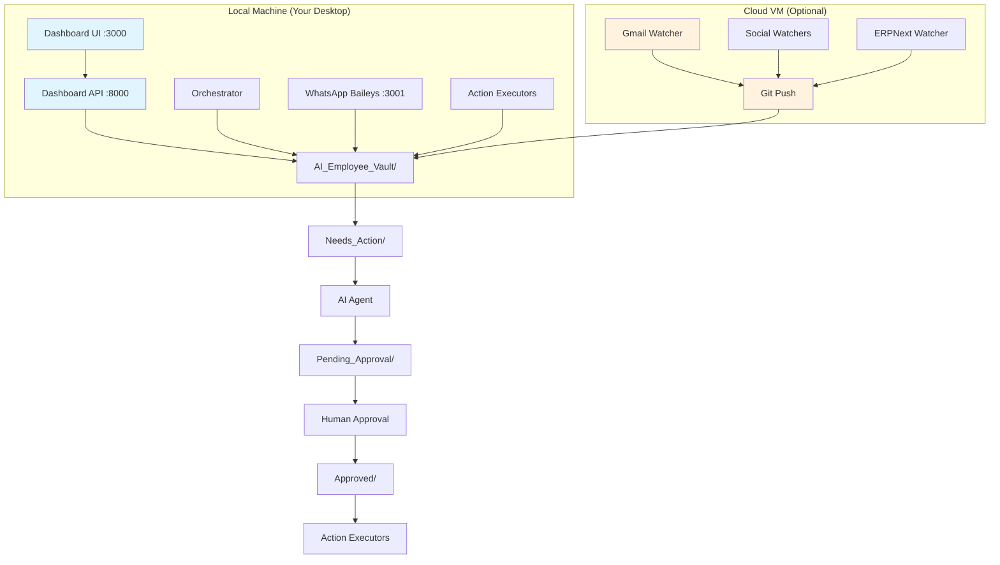

# AI Employee Digital FTE — Platinum Tier

> Your life and business on autopilot. Always-On Cloud + Local Executive. Agent-driven, human-in-the-loop.

[](LICENSE)
[](https://python.org)
[](https://nodejs.org)

---

## Overview

A **Platinum Tier** Digital FTE (Full-Time Equivalent) that runs 24/7 with Cloud + Local architecture. This AI-powered executive assistant handles email, social media, WhatsApp, accounting, and business operations with full human oversight.

### Architecture Tiers

| Tier | Description | Deployment | Cost |
|------|-------------|------------|------|
| **Silver** | Local-only, manual triggers | Single machine | Free |
| **Gold** | Local + scheduled automation | Single machine | Free |
| **Platinum** | Cloud watchers + Local execution | Cloud VM + Local | ~$0-5/month |

### Key Features

- **🤖 AI-Powered Drafting** — Claude/Qwen/Gemini generate responses and content
- **👥 Human-in-the-Loop** — Every action requires approval before execution
- **🔄 Git-Sync Vault** — Secure sync between Cloud and Local machines
- **📱 Multi-Channel** — Email, WhatsApp, LinkedIn, Twitter/X, Facebook, Instagram
- **💼 Business Operations** — ERPNext accounting, audit reports, project planning
- **🛡️ Security First** — Credentials never sync, all actions logged and auditable
- **📊 Live Dashboard** — Real-time status monitoring and task management
- **⚡ One-Command Setup** — `start.bat` launches all services automatically

---

## Quick Start (5 Minutes)

### Prerequisites

| Tool | Version | Install Command |
|------|---------|-----------------|
| Python | 3.13+ | `winget install Python.Python.3.13` |
| Node.js | 24+ LTS | `winget install OpenJS.NodeJS.LTS` |
| Git | Latest | `winget install Git.Git` |
| Obsidian | 1.10.6+ | [obsidian.md](https://obsidian.md) |
| **AI Agent** (choose one) | | |
| ↳ Claude Code | Latest | `npm i -g @anthropic/claude-code` |
| ↳ Qwen Code | Latest | `npm i -g @qwen-code/qwen-code@latest` |
| ↳ Gemini CLI | Latest | `npm i -g @google/gemini-cli` |

### 1. Clone and Setup

```bash
# Clone the repository
git clone https://github.com/Sheikh-Muhammad-Mujtaba/AI-Employee-Digital-FTE.git
cd AI-Employee-Digital-FTE

# Copy environment template
cp .env.example .env

# Edit .env with your credentials (see Environment Variables section below)
notepad .env
```

### 2. Install Dependencies

```bash
# Install Python dependencies
pip install -r requirements.txt

# Install backend dependencies
cd backend
pip install -r requirements.txt
cd ..

# Install frontend dependencies
cd frontend
npm install
cd ..

# Install WhatsApp Baileys
cd whatsapp-baileys
npm install
cd ..

# Install Email MCP
cd email-mcp
npm install
cd ..

# Install ERPNext MCP
cd ERP_Next-MCP
pip install -r requirements.txt
cd ..

# Install Playwright browsers
pip install playwright
python -m playwright install chromium
```

### 3. First Run

```bash
# ⚡ One-command startup (opens 9 terminal windows)
start.bat
```

This launches:
- **Dashboard API** (FastAPI :8000)
- **Dashboard UI** (Next.js :3000)
- **WhatsApp Baileys** (:3001)
- **Orchestrator** (watches vault folders)
- **Gmail Watcher** (polls every 2min)
- **LinkedIn Watcher** (monitors queue)
- **Twitter Watcher** (monitors queue)
- **Facebook Watcher** (monitors queue)
- **ERPNext Watcher** (polls every 15min)

### 4. Setup Dashboard

1. Open **http://localhost:3000**
2. Click **"First time? Create admin user"**
3. Login with: `admin` / `admin123`
4. Go to **WhatsApp** tab → scan QR code
5. Configure social media credentials in **Settings**

---

## Repository Structure

```
AI-Employee-Digital-FTE/
├── 📁 backend/                    # FastAPI dashboard API
│   ├── main.py                    # App entry point
│   ├── config.py                  # Environment config
│   ├── database.py                # SQLAlchemy 2.0 + SQLite
│   ├── models.py                  # User model
│   ├── auth.py                    # JWT authentication
│   ├── schemas.py                 # Pydantic request/response models
│   ├── vault_parser.py            # Markdown parser for vault files
│   ├── requirements.txt
│   └── routers/
│       ├── auth_router.py         # Login + seed admin
│       ├── vault_router.py        # Dashboard status endpoint
│       ├── tasks_router.py        # Task approve/reject/list
│       ├── projects_router.py     # Business goals + plans
│       └── whatsapp_router.py     # Proxy to Baileys HTTP API
├── 📁 frontend/                   # Next.js 15 dashboard UI
│   ├── src/app/
│   │   ├── layout.tsx             # Root layout
│   │   ├── page.tsx               # Root redirect
│   │   ├── login/                 # Login page
│   │   ├── dashboard/             # Dashboard overview
│   │   ├── tasks/                 # Task review (approve/reject)
│   │   ├── projects/              # Projects & plans
│   │   └── whatsapp/              # WhatsApp status + send
│   ├── components/
│   │   └── Sidebar.tsx            # Navigation sidebar
│   └── lib/api.ts                 # Typed API client with JWT
├── 📁 whatsapp-baileys/           # WhatsApp automation (Baileys v7)
│   ├── index.js                   # Main service + HTTP API
│   ├── package.json
│   └── auth_info/                 # (auto-created) WhatsApp credentials
├── 📁 AI_Employee_Vault/          # Obsidian vault (data layer)
│   ├── 📄 Dashboard.md            # Real-time status summary
│   ├── 📄 Business_Goals.md       # Q1 objectives & metrics
│   ├── 📄 Company_Handbook.md     # AI behavioral rules
│   ├── 📁 Inbox/                  # Raw input files (drop here)
│   ├── 📁 Needs_Action/           # Triggers Claude processing
│   ├── 📁 Pending_Approval/       # Drafts awaiting human review
│   ├── 📁 Approved/               # Human-approved → execute
│   ├── 📁 Rejected/               # Denied or expired tasks
│   ├── 📁 Done/                   # Completed archive
│   ├── 📁 Plans/                  # Multi-step project plans
│   ├── 📁 Briefings/              # Weekly CEO reports
│   ├── 📁 Social_Queue/           # Platform-specific post queues
│   ├── 📁 Accounting/             # ERPNext snapshots
│   ├── 📁 Audit_Reports/          # Weekly business audits
│   └── 📁 Logs/                   # JSONL activity logs
├── 📁 watchers/                   # Python automation scripts
│   ├── orchestrator.py            # Core — watches folders, triggers AI
│   ├── base_watcher.py            # Abstract base class
│   ├── filesystem_watcher.py      # Local file drop monitor
│   ├── gmail_watcher.py           # Gmail API polling
│   ├── linkedin_watcher.py        # LinkedIn queue monitor
│   ├── linkedin_poster.py         # Playwright LinkedIn automation
│   ├── twitter_watcher.py         # Twitter/X monitor
│   ├── twitter_poster.py          # Playwright Twitter automation
│   ├── facebook_watcher.py        # Facebook monitor
│   ├── meta_poster.py             # Playwright FB/IG automation
│   ├── erpnext_watcher.py         # ERPNext API polling
│   ├── scheduler.py               # Cron-like triggers
│   └── log_summary.py             # Log aggregation
├── 📁 email-mcp/                  # Email MCP server (Node.js)
├── 📁 ERP_Next-MCP/               # ERPNext MCP server (Python)
├── 📁 platinum/                   # Cloud deployment scripts
├── 📁 .claude/                    # Claude Code configuration
│   ├── skills/                    # Agent skill templates
│   └── hooks/                     # Ralph Wiggum loop (5 iterations max)
├── 📄 .env.example                # Environment template
├── 📄 mcp.json                    # Claude Code MCP config
├── 📄 start.bat                   # ⚡ One-command startup
├── 📄 ARCHITECTURE.md             # System architecture diagram
├── 📄 plan.md                     # Development roadmap
├── 📄 todo.md                     # Current tasks
└── 📄 README.md                   # This file
```

---

## Architecture



### Data Flow

1. **Input** → Files drop into `/Inbox/` or watchers poll APIs
2. **Processing** → Orchestrator moves to `/Needs_Action/` → AI agent drafts
3. **Review** → Drafts go to `/Pending_Approval/` → Human reviews in Dashboard
4. **Execution** → Approved moves to `/Approved/` → Orchestrator executes
5. **Archive** → Completed moves to `/Done/` with full audit trail

---

## Environment Variables

Copy `.env.example` to `.env` and configure:

### Required
```bash
# AI Agent (choose one)
AGENT=claude  # or 'qwen' or 'gemini'

# Dashboard
DASHBOARD_SECRET_KEY=your-super-secret-jwt-key-change-this
DASHBOARD_FRONTEND_ORIGIN=http://localhost:3000

# Security
DRY_RUN=true  # Set to 'false' for live execution
```

### Optional (by feature)

```bash
# Gmail Integration
GMAIL_CLIENT_ID=your-google-oauth-client-id
GMAIL_CLIENT_SECRET=your-google-oauth-client-secret
GMAIL_REFRESH_TOKEN=run-python-watchers/gmail_watcher.py---get-token

# Social Media (Playwright automation)
LINKEDIN_EMAIL=your-linkedin-email
LINKEDIN_PASSWORD=your-linkedin-password
TWITTER_EMAIL=your-twitter-email
TWITTER_PASSWORD=your-twitter-password
FACEBOOK_EMAIL=your-facebook-email
FACEBOOK_PASSWORD=your-facebook-password

# ERPNext Integration
ERPNEXT_URL=https://your-erpnext-instance.com
ERPNEXT_API_KEY=your-api-key
ERPNEXT_API_SECRET=your-api-secret

# WhatsApp
WA_KEYWORDS=urgent,important,question
WA_HTTP_PORT=3001

# Email MCP
EMAIL_MCP_PATH=./email-mcp/index.js

# Logging
LOG_LEVEL=INFO
```

---

## Workflow Examples

### Email Response
1. Gmail Watcher detects new email → creates `Needs_Action/EMAIL_abc123.md`
2. Orchestrator triggers Claude → drafts reply in `Pending_Approval/REPLY_John.md`
3. Dashboard shows task → you approve → moves to `Approved/`
4. Orchestrator sends email via Email MCP → archives to `Done/`

### Social Media Posting
1. LinkedIn Watcher checks queue → creates `Needs_Action/LINKEDIN_Post.md`
2. Claude drafts engaging post → `Pending_Approval/LINKEDIN_Draft.md`
3. You review and approve → `Approved/` → Playwright posts to LinkedIn

### WhatsApp Automation
1. WhatsApp Baileys receives message → filters by keywords
2. Creates `Needs_Action/WHATSAPP_John.md` → Claude drafts response
3. Human approval → sends via Baileys HTTP API

### Accounting Audit
1. Scheduler triggers weekly → `Needs_Action/AUDIT_Weekly.md`
2. Claude analyzes ERPNext data → generates report
3. Human review → executes payment reconciliations

---

## MCP Servers

Configured in `mcp.json` for Claude Code integration:

| Server | Purpose | Language | Transport |
|--------|---------|----------|-----------|
| `email-mcp` | Gmail send/draft/search | Node.js | stdio |
| `erpnext-mcp` | ERPNext read/write | Python | stdio |
| `browsing-mcp` | Web automation | Node.js | stdio |
| `windows-mcp` | Desktop UI automation | Python | stdio |

Start Claude with MCP: `claude --mcp-config mcp.json`

---

## Platinum Tier Deployment

For production with Cloud + Local separation:

### Cloud VM Setup (Oracle/AWS Free Tier)
```bash
# On Cloud VM
git clone <repo>
cd AI-Employee-Digital-FTE
./platinum/cloud_setup.sh  # Installs watchers, configures systemd
```

### Local Sync Setup
```bash
# On Local Machine
cd AI_Employee_Vault
git remote add cloud ubuntu@your-cloud-vm:/opt/ai-employee/vault-sync
../platinum/local_sync.sh  # Sets up bidirectional sync
```

### Test Platinum Flow
```bash
python platinum/test_platinum_tier.py
```

---

## Troubleshooting

### Common Issues

| Issue | Symptom | Fix |
|-------|---------|-----|
| **Vault not found** | `FileNotFoundError` | Check `--vault` path in `start.bat` |
| **Claude not found** | `claude: command not found` | `npm i -g @anthropic/claude-code` |
| **Gmail auth failed** | Token expired | `python watchers/gmail_watcher.py --get-token` |
| **Dashboard login fails** | 401 Unauthorized | `POST /api/auth/seed` to create admin user |
| **WhatsApp QR expired** | Can't connect | Restart Baileys service — QR regenerates |
| **Social auth fail** | Login timeout | Run poster with `--test-login`, verify `.env` creds |
| **Playwright error** | `Browser not found` | `python -m playwright install chromium` |
| **Pydantic build fail** | Import error | `pip install 'pydantic>=2.11.0'` (Python 3.14+) |
| **Content extraction** | Empty posts/emails | Fixed in v1.2+ — uses `extract_body_content()` |
| **File move errors** | `FileExistsError` | Auto-handled with timestamp suffixes |

### Debug Commands

```bash
# Check all services
curl http://localhost:8000/api/vault/status

# Test WhatsApp
curl http://localhost:3001/status

# Test email MCP
node email-mcp/index.js --help

# Test social login
python watchers/linkedin_poster.py --test-login
python watchers/twitter_poster.py --test-login
python watchers/meta_poster.py --test-login --platform facebook

# View logs
tail -f AI_Employee_Vault/Logs/$(date +%Y-%m-%d).jsonl
```

### Performance Tuning

- **Email rate limit**: 10/hour default (configurable)
- **Watcher intervals**: Gmail (2min), ERPNext (15min), Social (5min)
- **File expiry**: 48 hours in Pending_Approval
- **Log rotation**: Daily JSONL files, 30-day retention

---

## Security & Compliance

- **HITL (Human-in-the-Loop)**: Every external action requires approval
- **DRY_RUN mode**: Default safe mode logs actions without executing
- **Credential isolation**: `.env` never syncs, vault contains no secrets
- **Audit trail**: Every action logged with timestamps and context
- **Auto-expiry**: Stale approvals move to `/Rejected/` after 48 hours
- **Git security**: Sensitive files in `.gitignore`, sync only safe data

### Privacy Features

- WhatsApp credentials stored locally in `auth_info/` (gitignored)
- Social media cookies saved locally in vault `Logs/` (gitignored)
- Email tokens refresh automatically, never stored in vault
- All API calls logged but credentials never exposed

---

## Development

### Adding New Watchers

1. Extend `base_watcher.py`
2. Add to `start.bat`
3. Configure in `.env`
4. Update `mcp.json` if needed

### Custom Skills

Agent skills in `.claude/skills/`:
- `email-sequence/` — Automated email campaigns
- `social-content/` — Social media content creation
- `erpnext-mcp/` — ERPNext integration
- `browsing-with-playwright/` — Web automation

### Testing

```bash
# Unit tests
python -m pytest

# Integration tests
python platinum/test_platinum_tier.py

# Load testing
python watchers/log_summary.py --performance
```

---

## Contributing

1. Fork the repository
2. Create feature branch: `git checkout -b feature/new-watcher`
3. Make changes with tests
4. Submit pull request

### Code Standards

- Python: Black formatting, type hints required
- TypeScript: ESLint + Prettier
- JavaScript: StandardJS
- Commit messages: Conventional commits

---

## License

MIT License - see [LICENSE](LICENSE) file.

---

## Changelog

### v1.2.0 (Latest)
- ✅ Fixed content extraction for emails/social posts (no more empty bodies)
- ✅ Improved file move handling (prevents `FileExistsError`)
- ✅ Enhanced WhatsApp content parsing
- ✅ Better error handling in orchestrators

### v1.1.0
- ✅ Platinum tier deployment scripts
- ✅ Git vault sync between Cloud/Local
- ✅ Enhanced dashboard with real-time updates
- ✅ WhatsApp Baileys v7 integration

### v1.0.0
- ✅ Core HITL workflow
- ✅ Multi-channel automation (email, social, WhatsApp)
- ✅ ERPNext integration
- ✅ Dashboard UI
- ✅ MCP server architecture

---

_Built for Hackathon 0 — Personal AI Employee · Platinum Tier_

> "The future of work is not human or machine, but human with machine." 🚀
| 4 | Orchestrator | — | Watches `Needs_Action/` and `Approved/` |
| 5 | Gmail Watcher | — | Polls Gmail API every 2 min |
| 6 | LinkedIn Watcher | — | Monitors LinkedIn queue |
| 7 | Twitter Watcher | — | Monitors Twitter/X queue |
| 8 | Facebook Watcher | — | Monitors Facebook + Instagram |
| 9 | ERPNext Watcher | — | Polls ERPNext API every 15 min |

### 4. First-time dashboard login

1. Open **http://localhost:3000**
2. Click **"First time? Create admin user"**
3. Login: `admin` / `admin123`
4. Navigate to **WhatsApp** tab → scan QR code to link your WhatsApp

---

## Repository Structure

```
AI-Employee-Digital-FTE/
├── backend/                  # FastAPI dashboard API
│   ├── main.py               # App entry point
│   ├── config.py              # Environment config
│   ├── database.py            # SQLAlchemy 2.0 + SQLite
│   ├── models.py              # User model
│   ├── auth.py                # JWT authentication
│   ├── schemas.py             # Pydantic request/response models
│   ├── vault_parser.py        # Markdown parser for vault files
│   ├── requirements.txt
│   └── routers/
│       ├── auth_router.py     # Login + seed admin
│       ├── vault_router.py    # Dashboard status endpoint
│       ├── tasks_router.py    # Task approve/reject/list
│       ├── projects_router.py # Business goals + plans
│       └── whatsapp_router.py # Proxy to Baileys HTTP API
├── frontend/                  # Next.js 15 dashboard UI
│   ├── src/
│   │   ├── app/
│   │   │   ├── layout.tsx     # Root layout
│   │   │   ├── page.tsx       # Root redirect
│   │   │   ├── login/         # Login page
│   │   │   ├── dashboard/     # Dashboard overview
│   │   │   ├── tasks/         # Task review (approve/reject)
│   │   │   ├── projects/      # Projects & plans
│   │   │   └── whatsapp/      # WhatsApp status + send
│   │   ├── components/
│   │   │   └── Sidebar.tsx    # Navigation sidebar
│   │   └── lib/
│   │       └── api.ts         # Typed API client with JWT
│   ├── package.json
│   └── tsconfig.json
├── whatsapp-baileys/          # WhatsApp watcher (Baileys v7)
│   ├── index.js               # Main service
│   ├── package.json
│   └── auth_info/             # (auto-created) WhatsApp credentials
├── AI_Employee_Vault/         # Obsidian vault (data layer)
│   ├── Dashboard.md           # Real-time status summary
│   ├── Business_Goals.md      # Q1 objectives & metrics
│   ├── Company_Handbook.md    # AI rules of engagement
│   ├── Inbox/                 # Raw input files drop here
│   ├── Needs_Action/          # Triggers for Claude processing
│   ├── Pending_Approval/      # Drafts awaiting human review
│   ├── Approved/              # Human-approved → execute
│   ├── Rejected/              # Denied or expired
│   ├── Done/                  # Completed archive
│   ├── Plans/                 # Multi-step project plans
│   ├── Briefings/             # Weekly CEO reports
│   ├── Social_Queue/          # Platform-specific post queues
│   ├── Accounting/            # ERPNext snapshots
│   ├── Audit_Reports/         # Weekly business audits
│   └── Logs/                  # JSONL activity logs
├── watchers/                  # Python automation scripts
│   ├── orchestrator.py        # Core — watches folders, triggers Claude
│   ├── base_watcher.py        # Abstract base class
│   ├── filesystem_watcher.py  # Local file drop monitor
│   ├── gmail_watcher.py       # Gmail API polling
│   ├── linkedin_watcher.py    # LinkedIn queue monitor
│   ├── linkedin_poster.py     # Playwright LinkedIn poster
│   ├── twitter_watcher.py     # Twitter/X monitor
│   ├── twitter_poster.py      # Playwright Twitter poster
│   ├── facebook_watcher.py    # Facebook monitor
│   ├── meta_poster.py         # Playwright FB/IG poster
│   ├── erpnext_watcher.py     # ERPNext API polling
│   ├── scheduler.py           # Cron-like daily/weekly triggers
│   └── log_summary.py         # Log aggregation
├── email-mcp/                 # Email MCP server (Node.js)
├── ERP_Next-MCP/              # ERPNext MCP server (Python)
├── .claude/skills/            # Agent skill templates
├── .env.example               # Environment template
├── mcp.json                   # Claude Code MCP config
├── start.bat                  # ⚡ One-command startup
├── ARCHITECTURE.md            # System architecture diagram
└── README.md                  # This file
```

---

## Architecture


### Data Flow

1. **Input** → Files drop into `/Inbox/` or watchers poll APIs
2. **Processing** → Orchestrator moves to `/Needs_Action/` → AI agent drafts
3. **Review** → Drafts go to `/Pending_Approval/` → Human reviews in Dashboard
4. **Execution** → Approved moves to `/Approved/` → Orchestrator executes
5. **Archive** → Completed moves to `/Done/` with full audit trail

---

## Platinum Tier Deployment

For production deployment with Cloud VM + Local sync:

```bash
# 1. Setup Cloud VM (Oracle/AWS Free Tier)
ssh ubuntu@your-cloud-vm
./platinum/cloud_setup.sh

# 2. Configure Local sync
cd AI_Employee_Vault
git remote add cloud ubuntu@your-cloud-vm:/opt/ai-employee/vault-sync
bash ../platinum/local_sync.sh

# 3. Test Platinum flow
python ../platinum/test_platinum_tier.py
```

See [`platinum/README.md`](platinum/README.md) for full deployment guide.

---

## Environment Variables

Copy `.env.example` to `.env` and configure:

| Variable | Required | Description |
|----------|----------|-------------|
| `DRY_RUN` | ✅ | `true` = log-only mode (default), `false` = live |
| `AGENT` | ✅ | AI agent CLI: `claude`, `gemini`, or `qwen` (default: `claude`) |
| `GMAIL_CLIENT_ID` | For Gmail | Google OAuth client ID |
| `GMAIL_CLIENT_SECRET` | For Gmail | Google OAuth client secret |
| `GMAIL_REFRESH_TOKEN` | For Gmail | Run `gmail_watcher.py --get-token` |
| `LINKEDIN_EMAIL` | For LinkedIn | Playwright login email |
| `LINKEDIN_PASSWORD` | For LinkedIn | Playwright login password |
| `TWITTER_EMAIL` | For Twitter | X.com login email |
| `TWITTER_PASSWORD` | For Twitter | X.com login password |
| `FACEBOOK_EMAIL` | For Facebook | Meta login email |
| `FACEBOOK_PASSWORD` | For Facebook | Meta login password |
| `ERPNEXT_URL` | For ERPNext | ERPNext instance URL |
| `DASHBOARD_SECRET_KEY` | Dashboard | JWT signing key (change in prod!) |
| `DASHBOARD_FRONTEND_ORIGIN` | Dashboard | Default: `http://localhost:3000` |
| `WA_KEYWORDS` | WhatsApp | Comma-separated trigger keywords |
| `WA_HTTP_PORT` | WhatsApp | Baileys HTTP API port (default: 3001) |

---

## Workflow Example

1. An email arrives → **Gmail Watcher** creates `Needs_Action/EMAIL_abc123.md`
2. **Orchestrator** detects the file → triggers **Claude Code** to process it
3. Claude drafts a reply → writes to `Pending_Approval/REPLY_John.md`
4. You open the **Dashboard** → go to **Tasks** → click **✓ Approve**
5. File moves to `Approved/` → Orchestrator sends the email via `email-mcp`
6. File archived to `Done/` → Dashboard updates

Same flow for WhatsApp messages, social media posts, and ERPNext actions.

---

## MCP Servers

Configured in `mcp.json` for Claude Code:

| Server | Purpose | Transport |
|--------|---------|-----------|
| `email` | Send/draft Gmail | node stdio |
| `erpnext` | ERPNext CRUD | python stdio |
| `browser` | Ad-hoc web automation | npx stdio |
| `windows-mcp` | Windows desktop UI automation | uvx stdio |

Start Claude with: `claude --mcp-config mcp.json`

---

## Troubleshooting

| Issue | Fix |
|-------|-----|
| `Vault not found` | Verify `--vault` path or check `start.bat` paths |
| `claude` not found | Install Claude CLI: `npm i -g @anthropic/claude-code` |
| Gmail auth failed | Re-run `python watchers/gmail_watcher.py --get-token` |
| Dashboard login fails | Hit `POST /api/auth/seed` first to create admin user |
| WhatsApp QR expired | Restart the Baileys service — QR auto-regenerates |
| Playwright auth fail | Run poster with `--test-login`, check `.env` creds |
| `pydantic-core` build fail | You need `pydantic>=2.11.0` for Python 3.14 support |

---

## Security

- **DRY_RUN=true** is the default — flip to `false` only when ready
- **HITL** — Every external action goes through `/Pending_Approval/` first
- **48h expiry** — Stale approvals auto-move to `/Rejected/`
- **Credentials** — All secrets in `.env`, never in the vault. `.env` is gitignored
- **Audit logs** — Every action logged to `Logs/YYYY-MM-DD.jsonl`

---

## Notes

- Keep `Company_Handbook.md` updated for AI behavioral rules
- Dashboard reads directly from the Obsidian vault — changes are live
- WhatsApp Baileys stores credentials in `whatsapp-baileys/auth_info/` (gitignored)
- The Ralph Wiggum loop (`.claude/hooks/`) caps at 5 iterations per task

---

_Built for Hackathon 0 — Personal AI Employee · Gold Tier_
┌─────────────────────────────────────────────────────────────────────────┐
│              DASHBOARD (Next.js :3000 + FastAPI :8000)                  │
│  Login → Overview → Tasks → Projects → WhatsApp                       │
└───────────────────┬─────────────────────────────────────────────────────┘
                    │ reads/writes
                    ▼
┌─────────────────────────────────────────────────────────────────────────┐
│                    AI_Employee_Vault/ (Obsidian)                        │
│  /Inbox → /Needs_Action → /Pending_Approval → /Approved → /Done       │
└───────────┬─────────────────────────────┬───────────────────────────────┘
            │ watchdog events              │ file moves
            ▼                              ▼
┌───────────────────────┐    ┌────────────────────────────────────────────┐
│  WATCHERS (Python)    │    │  ORCHESTRATOR (orchestrator.py)            │
│  Gmail, LinkedIn,     │    │  Watchdog on /Needs_Action → Claude Code  │
│  Twitter, Facebook,   │    │  Watchdog on /Approved → Action Executors │
│  ERPNext, Scheduler   │    └────────────────────────────────────────────┘
└───────────────────────┘
┌───────────────────────┐    ┌────────────────────────────────────────────┐
│  WhatsApp Baileys     │    │  ACTION EXECUTORS                         │
│  (:3001) — keyword    │    │  send_email → email-mcp                   │
│  filtering, QR pair,  │    │  post_linkedin → linkedin_poster.py       │
│  send/receive msgs    │    │  post_twitter → twitter_poster.py         │
└───────────────────────┘    │  post_facebook/ig → meta_poster.py        │
                             └────────────────────────────────────────────┘
```

---

## Platinum Tier Deployment

For production deployment with Cloud VM + Local sync:

```bash
# 1. Setup Cloud VM (Oracle/AWS Free Tier)
ssh ubuntu@your-cloud-vm
./platinum/cloud_setup.sh

# 2. Configure Local sync
cd AI_Employee_Vault
git remote add cloud ubuntu@your-cloud-vm:/opt/ai-employee/vault-sync
bash ../platinum/local_sync.sh

# 3. Test Platinum flow
python ../platinum/test_platinum_tier.py
```

See [`platinum/README.md`](platinum/README.md) for full deployment guide.

---

## Environment Variables

Copy `.env.example` to `.env` and configure:

| Variable | Required | Description |
|----------|----------|-------------|
| `DRY_RUN` | ✅ | `true` = log-only mode (default), `false` = live |
| `AGENT` | ✅ | AI agent CLI: `claude`, `gemini`, or `qwen` (default: `claude`) |
| `GMAIL_CLIENT_ID` | For Gmail | Google OAuth client ID |
| `GMAIL_CLIENT_SECRET` | For Gmail | Google OAuth client secret |
| `GMAIL_REFRESH_TOKEN` | For Gmail | Run `gmail_watcher.py --get-token` |
| `LINKEDIN_EMAIL` | For LinkedIn | Playwright login email |
| `LINKEDIN_PASSWORD` | For LinkedIn | Playwright login password |
| `TWITTER_EMAIL` | For Twitter | X.com login email |
| `TWITTER_PASSWORD` | For Twitter | X.com login password |
| `FACEBOOK_EMAIL` | For Facebook | Meta login email |
| `FACEBOOK_PASSWORD` | For Facebook | Meta login password |
| `ERPNEXT_URL` | For ERPNext | ERPNext instance URL |
| `DASHBOARD_SECRET_KEY` | Dashboard | JWT signing key (change in prod!) |
| `DASHBOARD_FRONTEND_ORIGIN` | Dashboard | Default: `http://localhost:3000` |
| `WA_KEYWORDS` | WhatsApp | Comma-separated trigger keywords |
| `WA_HTTP_PORT` | WhatsApp | Baileys HTTP API port (default: 3001) |

---

## Workflow Example

1. An email arrives → **Gmail Watcher** creates `Needs_Action/EMAIL_abc123.md`
2. **Orchestrator** detects the file → triggers **Claude Code** to process it
3. Claude drafts a reply → writes to `Pending_Approval/REPLY_John.md`
4. You open the **Dashboard** → go to **Tasks** → click **✓ Approve**
5. File moves to `Approved/` → Orchestrator sends the email via `email-mcp`
6. File archived to `Done/` → Dashboard updates

Same flow for WhatsApp messages, social media posts, and ERPNext actions.

---

## MCP Servers

Configured in `mcp.json` for Claude Code:

| Server | Purpose | Transport |
|--------|---------|-----------|
| `email` | Send/draft Gmail | node stdio |
| `erpnext` | ERPNext CRUD | python stdio |
| `browser` | Ad-hoc web automation | npx stdio |
| `windows-mcp` | Windows desktop UI automation | uvx stdio |

Start Claude with: `claude --mcp-config mcp.json`

---

## Troubleshooting

| Issue | Fix |
|-------|-----|
| `Vault not found` | Verify `--vault` path or check `start.bat` paths |
| `claude` not found | Install Claude CLI: `npm i -g @anthropic/claude-code` |
| Gmail auth failed | Re-run `python watchers/gmail_watcher.py --get-token` |
| Dashboard login fails | Hit `POST /api/auth/seed` first to create admin user |
| WhatsApp QR expired | Restart the Baileys service — QR auto-regenerates |
| Playwright auth fail | Run poster with `--test-login`, check `.env` creds |
| `pydantic-core` build fail | You need `pydantic>=2.11.0` for Python 3.14 support |

---

## Security

- **DRY_RUN=true** is the default — flip to `false` only when ready
- **HITL** — Every external action goes through `/Pending_Approval/` first
- **48h expiry** — Stale approvals auto-move to `/Rejected/`
- **Credentials** — All secrets in `.env`, never in the vault. `.env` is gitignored
- **Audit logs** — Every action logged to `Logs/YYYY-MM-DD.jsonl`

---

## Notes

- Keep `Company_Handbook.md` updated for AI behavioral rules
- Dashboard reads directly from the Obsidian vault — changes are live
- WhatsApp Baileys stores credentials in `whatsapp-baileys/auth_info/` (gitignored)
- The Ralph Wiggum loop (`.claude/hooks/`) caps at 5 iterations per task

---

_Built for Hackathon 0 — Personal AI Employee · Gold Tier_
